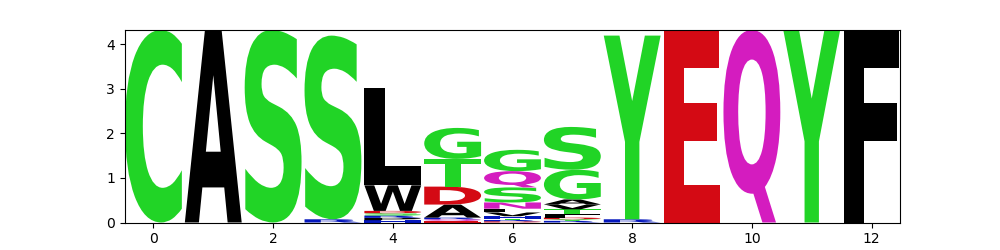
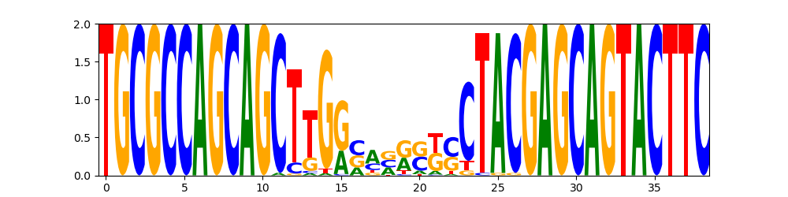

# Usage: clustering

[Clustering](functions.md#clustering) finds clusters in given clonosets.


## How to create clusters

`create_clusters` function args:

* `cl_filter`: see [the previous page](usage_stats.md#filtering-clonosets) and [Filter](functions.md#-clone_filter) for further explanations.
* `mismatches`: specifies the maximum number of mismatches allowed for clonotypes to qualify as neighbours (adjacent).
* `overlap_type`: Possible overlap types are [`aa`, `aaV`, `aaVJ`, `nt`, `ntV`, `ntVJ`], `aa`/`nt` stands for an amino acid or nucleotide sequence, and `V`/`J`/`VJ` denote a segment type.
* If `igh`=True, the constant (C) segment is kept.
* If `tcrdist_radius` is not None, only edges between clones with a tsrdist metric less than or equal to the specified radius are built. It overrides `overlap_type` and `mismatches`. A TCRdist modification is introduced: no gaps are allowed in CDR3, weights are in 3:1 ratio for CDR3 compared to other regions. Also, V-segment distances are pre-calculated and currently are available only for <i>Homo sapiens</i>.
* If `by_freq`=True (default), clonotype frequencies are used instead of counts.


```py
from repseq import clustering

clusters = clustering.create_clusters(clonosets_df, cl_filter=top_filter, mismatches=1, overlap_type="aaV", igh=False, tcrdist_radius=None, count_by_freq=True)
```

Output is a list of NetworkX Graph() objects — separate clusters and single nodes. The list is sorted by cluster size.

```py
clusters[:3]
[<networkx.classes.graph.Graph at 0x7fa133b1bd00>,
 <networkx.classes.graph.Graph at 0x7fa15200cb80>,
 <networkx.classes.graph.Graph at 0x7fa154aa3c10>]
```

<br>

## Clusters from a pooled DataFrame

Alternatively, one can create clusters from a dataframe with clonotypes. Mandatory columns are [`freq`, `count`, `v`, `j`, `cdr3aa`, `cdr3nt`, `sample_id`].

`pooled_df` example:

|    |   count |        freq | cdr3nt                                           | cdr3aa           | v        | d     | j       | c     |   VEnd |   DStart |   DEnd |   JStart | sample_id          |
|---:|--------:|------------:|:-------------------------------------------------|:-----------------|:---------|:------|:--------|:------|-------:|---------:|-------:|---------:|:-------------------|
|  0 |     117 | 7.46674e-05 | TGTGCCAGCAGTCGCCACAGTTACAGGGATGGCTACACCTTC       | CASSRHSYRDGYTF   | TRBV12-3 | TRBD1 | TRBJ1-2 | TRBC1 |     11 |       22 |     27 |       28 | sample1_nCD4_1_TRB |
|  1 |     109 | 6.95619e-05 | TGTGCCAGCAGTTTAGCGCATCAGGGAGGCAGCTATGGCTACACCTTC | CASSLAHQGGSYGYTF | TRBV12-4 | TRBD2 | TRBJ1-2 | TRBC1 |     18 |       23 |     28 |       32 | sample1_nCD4_1_TRB |
|  2 |     105 | 6.70092e-05 | TGTGCCAGCAGCCCGGGACTGGCCTACAATGAGCAGTTCTTC       | CASSPGLAYNEQFF   | TRBV12-3 | TRBD2 | TRBJ2-1 | TRBC2 |     10 |       11 |     19 |       22 | sample1_nCD4_1_TRB |


```py
create_clusters_from_pooled_df(pooled_df, mismatches=1, overlap_type="aaV", igh=False, tcrdist_radius=None,
                                   count_by_freq=True, _run_from_create_clusters=False)
```

## Adding metadata to clusters

Metadata, if present, could also be added to node properties prior to saving to Cytoscape. The info will be added to `node.additional_properties` dictionary. Note that the metadata should contain the same `sample_id`s that were used in the `clonosets_df` when creating the clusters. 

Metadata example:

|    | sample_id          |   group | type   |
|---:|:-------------------|--------:|:-------|
|  0 | sample1_nCD4_1_TRB |       1 | nCD4   |
|  1 | sample1_nCD8_1_TRB |       1 | nCD8   |
|  3 | sample2_nCD4_1_TRB |       2 | nCD4   |
|  4 | sample2_nCD8_1_TRB |       2 | nCD8   |


```py
clustering.add_metadata(clusters, metadata)
```

<br>

## Save clusters in Cytoscape format

Here, we filter out single-node clusters. Clusters are exported in two forms: edges are saved in a .sif file and cluster properties are in a tab-separated .csv file.  In the case of TCRdist, the edges are also assigned a length (radius).

```py
clusters_output_prefix = os.path.join(output_dir, "clusters")
# here, one-node clusters are filtered out
clusters_filtered = clustering.filter_one_node_clusters(clusters)
clustering.save_clusters_for_cytoscape(clusters_filtered, clusters_output_prefix, sample_metadata=metadata)
```

<br>

## Cluster properties

!!! tip "node size"
    If `weighed` is set to True, the weight of a node is determined by its size. The size of the node is defined by the `by_freq` parameter in the `create_clusters` function, which indicates whether the size is calculated based on counts or frequencies.

Cluster properties include consensus CDR3, v- and j-segment sequences, as well as some properties of clusters as graphs:

* diameter: the maximum eccentricity in a graph.
* [density](https://networkx.org/documentation/stable/reference/generated/networkx.classes.function.density.html): The density is 0 for a graph without edges and 1 for a complete graph. The density of multigraphs can be higher than 1.
* eccentricity: for a node v, it is the maximum distance from v to all other nodes in a graph. Cluster-wise, it is the average eccentricity of all the nodes within the cluster.

```py
cluster_properties = clustering.cluster_properties(clusters_filtered, weighed=True)
cluster_properties.to_csv('clusters.tsv', sep='\t')
```

|    | cluster_id   |   nodes |   edges |   diameter |   density |   eccentricity | concensus_cdr3aa   | concensus_cdr3nt                        | concensus_v   | concensus_j   |
|---:|:-------------|--------:|--------:|-----------:|----------:|---------------:|:-------------------|:----------------------------------------|:--------------|:--------------|
|  0 | cluster_0    |      58 |     164 |         10 | 0.0992136 |        7.96552 | CASSLTGSYEQYF      | TGCGCCAGCAGCTTGGCAGGGTCCTACGAGCAGTACTTC | TRBV5-1       | TRBJ2-7       |
|  1 | cluster_1    |      47 |     188 |          7 | 0.173913  |        5.40426 | CASSLGGNTEAFF      | TGCGCCAGCAGCTTGGCAGGGAACACTGAAGCTTTCTTT | TRBV5-1       | TRBJ1-1       |
|  2 | cluster_2    |      38 |     154 |          7 | 0.219061  |        5.5     | CASSLDTYEQYF       | TGCGCCAGCAGCTTGGACACCTACGAGCAGTACTTC    | TRBV5-1       | TRBJ2-7       |
|  3 | cluster_3    |      35 |     167 |          6 | 0.280672  |        4.45714 | CASSLSYEQYF        | TGTGCCAGCAGTTTAGCCTACGAGCAGTACTTC       | TRBV12-3      | TRBJ2-7       |
|  4 | cluster_4    |      33 |      79 |          7 | 0.149621  |        5.42424 | CASSLGTDTQYF       | TGCGCCAGCAGCTTGGGCACAGATACGCAGTATTTT    | TRBV5-1       | TRBJ2-3       |


For creating a table with counts or frequencies by cluster, see [the previous page](usage_intersections.md#count_table_by_cluster).

<br>


## Sequence logo

To visualize cluster's CDR3 consensus sequence, use `plot_cluster_logo`. Possible `seq_type` are `prot` and `dna`.

```py
clustering.plot_cluster_logo(clusters[0])
```



```py
clustering.plot_cluster_logo(clusters[0], seq_type='dna', weighed=True)
```


<br>


##  Custom cluster metric example

```py
top_filter = clf.Filter(functionality="f", top=4000, by_umi=True, mix_tails=True, seed=100)
cd4_clusters = clustering.create_clusters(clonosets_df, cl_filter=top_filter, mismatches=1, overlap_type="aaV", igh=False, tcrdist_radius=None, count_by_freq=True)
clustering.add_metadata(clonosets_df, metadata)
```

Metadata in this example:

|    | sample_id        | experimental_group   | subset   |
|---:|:-----------------|:---------------------|:---------|
|  0 | UCB4_nCD4_1_TRB  | late                 | nCD4     |
|  4 | UCB11_nCD4_1_TRB | preterm              | nCD4     |
|  7 | UCB10_nCD4_1_TRB | term                 | nCD4     |
|  8 | UCB2_nCD4_1_TRB  | term                 | nCD4     |

This function calculates the total frequency of all clonotypes within a cluster, as well as the percentage of clonotypes from different experimental groups present in the cluster.

```py
def calc_custom_clusters_properties(clusters):
    results = []
    properties = ["nodes", "sum_frequency", "preterm_percent", "term_percent", "late_percent"]
    
    for cluster in clusters:
        
        prop1_nodes = len(cluster)
        prop2_sum_size = sum([node.size for node in cluster])
        prop3_sum_size = calc_cluster_preterm_clones_percent(cluster)
        
        result = [prop1_nodes, prop2_sum_size, *prop3_sum_size]
    
        results.append(result)
    df = pd.DataFrame(results, columns = properties)
    return df

def calc_cluster_clones_percent(cluster):
    total_size = sum([node.size for node in cluster])
    preterm = sum([node.size for node in cluster if node.additional_properties["experimental_group"] == "preterm"])
    term = sum([node.size for node in cluster if node.additional_properties["experimental_group"] == "term"])
    late = sum([node.size for node in cluster if node.additional_properties["experimental_group"] == "late"])
    percent_preterm = round(preterm/total_size*100, 2)
    percent_term = round(term/total_size*100, 2)
    percent_late = round(late/total_size*100, 2)
    return percent_preterm, percent_term, percent_late
```

|    |   nodes |   sum_frequency |   preterm_percent |   term_percent |   late_percent |
|---:|--------:|----------------:|------------------:|---------------:|---------------:|
|  0 |      73 |      0.0210043  |             24.1  |          62.04 |          13.86 |
|  1 |      41 |      0.0115223  |             44.21 |          41.43 |          14.36 |
|  2 |      39 |      0.0114498  |             25.18 |          65.35 |           9.47 |
|  3 |      38 |      0.0119551  |             32.43 |          55.64 |          11.93 |
|  4 |      29 |      0.00817272 |             36.06 |          55.56 |           8.38 |

<br>To see another example of a custom function for stats calculation, visit [stats](usage_stats.md#custom-stats) page.

<br>


## Community detection

```py
communities_louvain = clustering.find_cluster_communities_louvain(clusters, resolution=1, threshold=1e-07, seed=1)
```

<br>

## [ALICE](https://journals.plos.org/plosbiology/article?id=10.1371/journal.pbio.3000314) (Antigen-specific Lymphocyte Identification by Clustering of Expanded sequences)

ALICE works by treating clonotypes as graph vertices, with edges connecting sequences which differ by at most 1 CDR3 amino acid. It identifies clonotypes with a higher numbers of neighbors than expected by a null model of recombination, separating clusters of antigen-responding clonotypes from clusters arising from recombination statistics.<br>Currently, it is implemented for <i>H.sapiens</i> only.

```py
alice(clusters, overlap_type='aaVJ', mismatches=1, species="hs", olga_warnings=False)
```