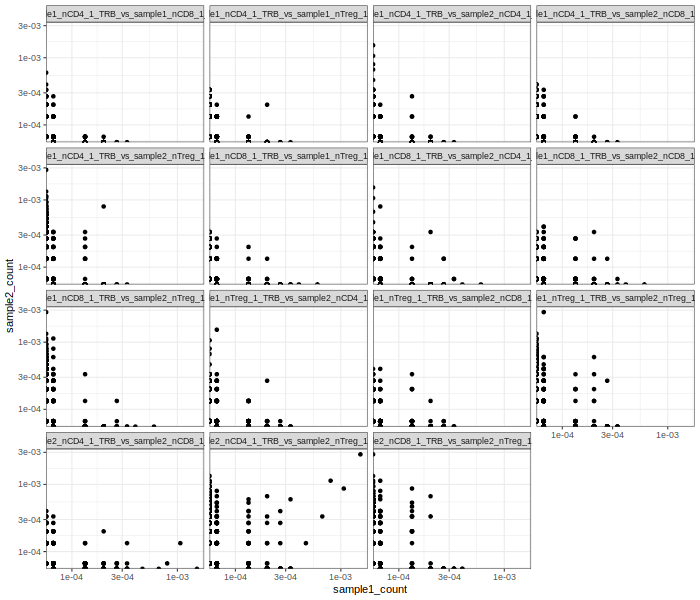

# Usage: intersections between clonosets

To see further details, check the [Intersections](functions.md#intersections) module.

## Clonoset intersection

`intersect_clones_in_samples_batch` function performs pairwise clonotype overlapping for all clonosets.
<br>Possible overlap types are [aa, aaV, aaVJ, nt, ntV, ntVJ], aa/nt stands for an amino acid or nucleotide sequence, and V/J/VJ denote a segment type. 
An output table contains clonotype sequence and V/J segments if required, overlapping clonotypes for each pair, and clonosets they belong to.    

!!! tip "clonosets_df and clonosets_df2"
    If `clonosets_df2` is None (default), `clonosets_df` is compared with itself, otherwise samples within `clonosets_df` are compared with each other; otherwise, the comparison is performed exclusively between samples from `clonosets_df` and `clonosets_df2`. 
    <br>If `cl_filter` is specified (default is None), it's applied to clonosets in `clonosets_df2`. If there are samples with non-unique `sample_id`s between the two dataframes, both filters will be applied to those samples.


```py
from repseq import intersections
from repseq import clone_filter as clf
from repseq import clustering

downsample_filter = clf.Filter(functionality="f", downsample=15000, by_umi=True, seed=100)
intersect_df = intersections.intersect_clones_in_samples_batch(clonosets_df, cl_filter=downsample_filter, overlap_type="aaV", by_freq=True)
```

|    | cdr3aa           | v        |   sample1_count |   sample2_count | sample1            | sample2            | pair                                     |
|---:|:-----------------|:---------|----------------:|----------------:|:-------------------|:-------------------|:-----------------------------------------|
|  0 | CASSLGQVNTEAFF   | TRBV12-3 |     6.66667e-05 |     0           | sample1_nCD4_1_TRB | sample2_nCD4_1_TRB | sample1_nCD4_1_TRB_vs_sample2_nCD4_1_TRB |
|  1 | CSARDPASGRVDTQYF | TRBV20-1 |     0           |     6.66667e-05 | sample1_nCD4_1_TRB | sample2_nCD4_1_TRB | sample1_nCD4_1_TRB_vs_sample2_nCD4_1_TRB |
|  2 | CASSPKQGNPYEQYF  | TRBV18   |     0           |     6.66667e-05 | sample1_nCD4_1_TRB | sample2_nCD4_1_TRB | sample1_nCD4_1_TRB_vs_sample2_nCD4_1_TRB |
|  3 | CASSWNPTGGTEAFF  | TRBV5-6  |     0           |     6.66667e-05 | sample1_nCD4_1_TRB | sample2_nCD4_1_TRB | sample1_nCD4_1_TRB_vs_sample2_nCD4_1_TRB |
|  4 | CASSLLAGGTDTQYF  | TRBV7-2  |     0           |     6.66667e-05 | sample1_nCD4_1_TRB | sample2_nCD4_1_TRB | sample1_nCD4_1_TRB_vs_sample2_nCD4_1_TRB |

<br>

## Overlap distances between clonosets

Calculate overlap distances between clonosets. F, F2, C, J, BC or JCD [metric](https://mixcr.com/mixcr/reference/mixcr-postanalysis/?h=pairwise#pairwise-distance-metrics) can be used. The mismatches option specifies the maximum number of mismatches allowed for clonotypes to be considered similar. 

* F2 - clonotype-wise sum of geometric mean frequencies
* F -  geometric mean of relative overlap frequencies
* C - total frequency of clonotypes in sample1 that are similar to clonotypes in sample2
* BC ([Bray-Curtis dissimilarity](https://en.wikipedia.org/wiki/Bray%E2%80%93Curtis_dissimilarity)) - sum of differences between clonotype frequencies or counts (`by_freq`=False) in sample1 and sample2 divided by the total counts in sample1 and sample2  
* J ([Jaccard index](https://en.wikipedia.org/wiki/Jaccard_index)) - size of sample1 and sample2 intersection divided by the size of their union
* JCD ([Jensen-Shannon divergence](https://en.wikipedia.org/wiki/Jensen%E2%80%93Shannon_divergence))

```py
f2_ntVJ = intersections.overlap_distances(clonosets, cl_filter=downsample_filter, overlap_type="ntVJ", mismatches=0, metric="F2")
f_cd4_aaV = intersections.overlap_distances(clonosets_df.query("subset=='nCD4'"), cl_filter=downsample_filter, overlap_type="aaV", mismatches=0, metric="F")
```

<br>

## `count_table`

Create a table containing the number of times each clonotype appears in each clonoset in `clonosets_df`. 
<br>For `overlap_type`, possible overlap types are [aa, aaV, aaVJ, nt, ntV, ntVJ], aa/nt stands for an amino acid or nucleotide sequence, and V/J/VJ denote a segment type. 

```py
count_table = intersections.count_table(clonosets, cl_filter=downsample_filter, overlap_type="aaV", mismatches=0)
```

|                                |   sample1_nCD4_1_TRB |   sample1_nCD8_1_TRB |   sample1_nTreg_1_TRB |   sample2_nCD4_1_TRB |   sample2_nCD8_1_TRB |   sample2_nTreg_1_TRB |
|:-------------------------------|---------------------:|---------------------:|----------------------:|---------------------:|---------------------:|----------------------:|
| ('CASSLGQVNTEAFF', 'TRBV12-3') |                    1 |                    0 |                     0 |                    0 |                    0 |                     0 |
| ('CASSPKQGNPYEQYF', 'TRBV18')  |                    0 |                    1 |                     0 |                    0 |                    0 |                     0 |
| ('CASSLLAGGTDTQYF', 'TRBV7-2') |                    0 |                    1 |                     0 |                    1 |                    1 |                     0 |
| ('CASSHGEGTQYF', 'TRBV3-1')    |                    2 |                    0 |                     0 |                    0 |                    0 |                     0 |
| ('CASSDREGYTEAFF', 'TRBV6-5')  |                    0 |                    1 |                     0 |                    0 |                    0 |                     0 |


## `count_table_by_cluster`

Create a count table for clusters as opposed to single clonotypes (clusters are provided by the user). They can be created with `create_clusters` function from [clustering](functions.md#clustering) module. 

```py
cluster_list = clustering.create_clusters(clonosets, cl_filter=top_filter, mismatches=1, overlap_type="aaV", igh=False, tcrdist_radius=None, count_by_freq=True)
clusters_filtered = clustering.filter_one_node_clusters(clusters)
```

```py
count_table_by_cluster = intersections.count_table_by_cluster(clonosets_df, clusters_list, cl_filter=downsample_filter, overlap_type="aaV", mismatches=1)
```

|    | feature_id   |   sample1_nCD4_1_TRB |   sample1_nCD8_1_TRB |   sample2_nCD4_1_TRB |   sample2_nCD8_1_TRB |
|---:|:-------------|---------------------:|---------------------:|---------------------:|---------------------:|
|  0 | cluster_0    |          0.000133333 |          0.0008      |          0.000866667 |          0.0014      |
|  1 | cluster_1    |          0.000333333 |          0.000333333 |          0.000666667 |          0.000866667 |
|  2 | cluster_2    |          0.000133333 |          0.000333333 |          0.000666667 |          0.000666667 |
|  3 | cluster_3    |          6.66667e-05 |          0.000333333 |          0.0008      |          0.0008      |
|  4 | cluster_4    |          0.000333333 |          0.000133333 |          0.00106667  |          6.66667e-05 |

<br>

## TCRnet

TCRnet compares two datasets with their respective clonosets, typically an experimental dataset and a control one. 

```py
clonoset_df_exp = ...
clonosets_df_control = ...
tcrnet_compared_clns = intersections.tcrnet(clonosets_df_exp, clonosets_df_control, cl_filter=downsampling, overlap_type="aaVJ", mismatches=1)
``` 

|    | clone                                      |   count_exp |   count_control |   group_count_exp |   group_count_control |    fold |   p_value_b |   p_value_p |   p_value_b_adj |   p_value_p_adj |   log10_b_adj |   log10_p_adj |   log2_fc |
|---:|:-------------------------------------------|------------:|----------------:|------------------:|----------------------:|--------:|------------:|------------:|----------------:|----------------:|--------------:|--------------:|----------:|
|  0 | ('CASSPGVGFVEKLFF', 'TRBV11-2', 'TRBJ1-4') |           1 |               1 |                 7 |                    29 | 4.14286 |    0.211254 |     0.20811 |        0.250473 |        0.247205 |      0.601239 |      0.606943 |   2.05063 |
|  1 | ('CASSLMKTENEKLFF', 'TRBV11-2', 'TRBJ1-4') |           1 |               0 |                 7 |                    29 | 8.28571 |    0        |     0       |        0        |        0        |    inf        |    inf        |   3.05063 |
|  2 | ('CASSLGGHPNEKLFF', 'TRBV11-2', 'TRBJ1-4') |           1 |               0 |                 7 |                    29 | 8.28571 |    0        |     0       |        0        |        0        |    inf        |    inf        |   3.05063 |


??? info "Visualization"
    Properties from proc_table can be visualized in Jupyter notebook using %%R cell magic. 
    
    
    ```py
    %%R -i intersect_df -h 600 -w 700
    intersect_df %>% 
        ggplot(aes(x=sample1_count, y=sample2_count)) +
            geom_point()+
            theme_bw()+
            facet_wrap(vars(pair)) +
            scale_x_log10() +
            scale_y_log10()
    ```
