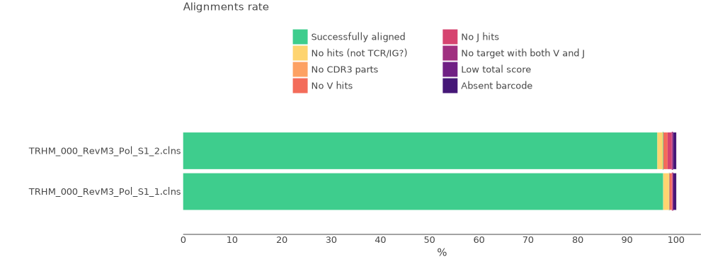
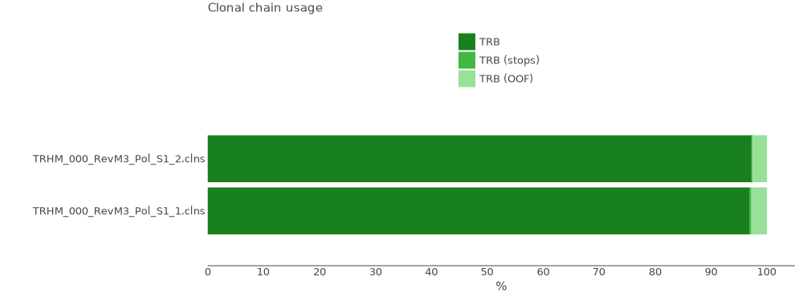
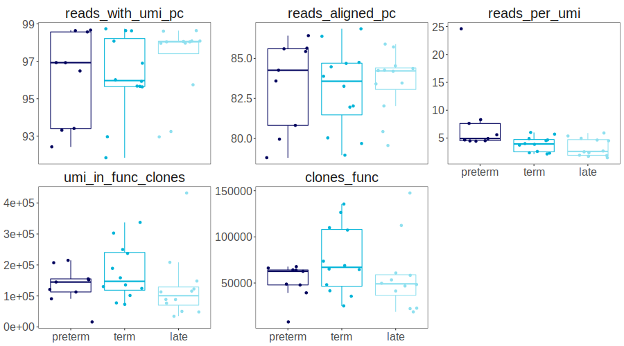

# Usage: working with MiXCR

MiXCR is the leading software for generating clonoset tables from raw FastQ files. [MiXCR module](functions.md#mixcr) allows to run MiXCR 4.3+ batch analyses with SLURM queue manager.

!!! note "Setting up the environment"
    Before getting started, make sure that main_repseq environment is chosen. Otherwise, check the [installation guide](installation.md)

## Working with metadata and creating a dataframe with samples 

Create `sample_df` from dataset metadata in `.yaml` format (if it's in a tabular format, use external libraries such as Pandas). Remove unnesessary columns if needed. Note If METADATA_FILENAME is absent, it is set to `metadata.yaml` by default. Note that this is relevant only for metadata created with NGSiK in CDR3.net group. 
<br>If your dataset does not have metadata, create the dataframe manually. <b>The neccessary columns are: `R1`, `R2`, `sample_id`</b>, where `R1` and `R2` contain paths (using full paths is strongly advised) to respective raw files, and sample_id are arbitrary unique identificators.

``` py
from repseq import mixcr as mx
from repseq import slurm
from repseq import io as repseqio

sample_df = repseqio.read_yaml_metadata(RAW_DATA_DIR, filename=METADATA_FILENAME)
metadata = sample_df.prop(columns=['R1', 'R2'])
output_dir = ...
path_to_mixcr_binary = ...
```

`sample_df` example:

|    | sample_id     | R1                                                         | R2                                                         |
|---:|:--------------|:-----------------------------------------------------------|:-----------------------------------------------------------|
|  0 | sample_1_nCD4 | /home/user/samples/sample1_nCD4_1_TRB_L001_R1_001.fastq.gz | /home/user/samples/sample1_nCD4_1_TRB_L001_R2_001.fastq.gz |
|  1 | sample_2_nCD4 | /home/user/samples/sample2_nCD4_1_TRB_L001_R1_001.fastq.gz | /home/user/samples/sample2_nCD4_1_TRB_L001_R2_001.fastq.gz |
|  2 | sample_3_nCD4 | /home/user/samples/sample3_nCD4_1_TRB_L001_R1_001.fastq.gz | /home/user/samples/sample3_nCD4_1_TRB_L001_R2_001.fastq.gz |

<br>

## Command template for `mixcr analyze`

Create a command template for mixcr analyze. The default template is `mixcr analyze milab-human-rna-tcr-umi-multiplex -f r1 r2 output_prefix` for Milab Hum TCR RNA multiplex kit. The default values are 32 GB for `memory` (required OOM in GB),  1.5 hours for `time_estimate` and 40 for `cpus` (in case of Aldan3 server, it is the size of a smallest node). Note that `mixcr analyze` and `r1 r2 output_prefix` are "magical" parts of the template that should be kept as-is in the template, so change only the part in-between these parts.
<br>For more detailed information on MiXCR presets, visit the [MiXCR website](https://mixcr.com/mixcr/reference/overview-built-in-presets/).


```py
mixcr_race_command_template = "mixcr analyze milab-mouse-rna-tcr-umi-race -f r1 r2 output_prefix"
```
<br>

## Running `mixcr analyze` in batches using SLURM

Run mixcr analyze in batches (Relevant only for servers using <b>SLURM</b>). This function generates a set of commands for each sample by creating a SLURM script for each command and submitting them to the SLURM queue. Scripts itself and .log files (contain std.out and std.error outputs) will be saved in `~/temp/SLURM`. 

```py
mx.mixcr4_analyze_batch(sample_df, output_dir, command_template=mixcr_race_command_template,
                        path_to_mixcr_binary)
```

<br>

To check the progress, use `check_slurm_progress`. `loop` set to `True` gives real-time updates with 0.5 s interval while `loop`=`False` shows current progress and runs in the background without blocking other cells. 
<br>Currently, `check_slurm_progress` might be unreliable in some cases, thus it's recommended to check SLURM queue and .log files in `~/temp/SLURM` folder manually.

```py
slurm.check_slurm_progress(os.path.join(output_dir, "mixcr_analyze_slurm_batch.log"), loop=True)
```
<br>

## Making report images

Make reports (combines `mixcr exportQc align`, `chainUsage` and `tags`) and get report images (both .pdf and .svg for `align` and `chainUsage`, only .pdf for `tags`). To see report images examples, visit the [MiXCR website](https://mixcr.com/mixcr/reference/qc-overview/).

* align — exports various quality control metrics
* chainUsage — calculates chain usage across all clonotypes
* tags — for samples with barcodes, provides barcode coverage statistics for every sample

To see progress, use `check_slurm_progress` as shown below

```py
mx.mixcr4_reports(output_dir, mixcr_path=path_to_mixcr_binary)
slurm.check_slurm_progress(os.path.join(output_dir, "mixcr_reports_slurm_batch.log"), loop=True)
mx.show_report_images(output_dir)
```





<br>

## Creating a table containing clonosets stats

Get a tabular report using `get_processing_table` function. It searches for clonosets in the the folder, extracts their sample_id's and shows main
processing stats in a table format. By default does not show "off-target" clonosets - 
those having less than 1% (default, may be overriden) of reads for the sample_id.
For example, you have sequenced TRB sample, but there is found 0.5% (by read count) 
of TRA chains for the same sample_id, then the clonoset will not be shown in the table.
You can specify `show_offtarget=True` to display all found chains in the table or 
outherwise set a higher value for `offtarget_chain_threshold` (`0.01` by default).

```py
proc_table = mx.get_processing_table(output_dir)
```

A full processing table example:

|    | sample_id          | extracted_chain   |   reads_total |   reads_with_umi_pc |   reads_aligned_pc |   reads_overlapped_aln_pc |   total_umi |   umi_after_correction |   overseq_threshold |   reads_after_filter |   umi_after_filter |   reads_per_umi |   clones_total |   reads_in_clones_total |   clones |   reads_in_clones |   clones_func |   reads_in_func_clones |   umi_in_clones |   umi_in_func_clones |
|---:|:-------------------|:------------------|--------------:|--------------------:|-------------------:|--------------------------:|------------:|-----------------------:|--------------------:|---------------------:|-------------------:|----------------:|---------------:|------------------------:|---------:|------------------:|--------------:|-----------------------:|----------------:|---------------------:|
|  0 | sample1_nCD4_1_TRB | TRB               |       2120957 |               98.63 |              86.38 |                      4.97 |      597401 |                 564176 |                   2 |              1612478 |             344972 |            4.67 |         145019 |                 1566962 |   145012 |           1566949 |        135644 |                1509856 |          349587 |               337223 |
|  3 | sample2_nCD4_1_TRB | TRB               |       1484339 |               98.64 |              85.43 |                      3.49 |      242845 |                 223565 |                   3 |              1183345 |             155008 |            7.63 |          69771 |                 1167512 |    69770 |           1167509 |         66237 |                1133350 |          156334 |               151913 |
|  6 | sample3_nCD4_1_TRB | TRB               |        940861 |               96.49 |              86.42 |                      2.84 |      279362 |                 236455 |                   2 |               734134 |             157646 |            4.66 |          68466 |                  715176 |    68465 |            715174 |         64208 |                 690533 |          160301 |               154995 |

Some columns may be omitted for better readability:

```py
small_proc_table = proc_table[["sample_id", "extracted_chain","reads_total", "reads_with_umi_pc", "reads_aligned_pc", "reads_per_umi", "overseq_threshold","clones_func", "umi_in_func_clones"]]
```

Columns:

|Parameters               | Description   |
|:------------------------|:--------------|
| sample_id               |sample_id specified in the clonoset filename|
| extracted_chain         |clonoset сhain specified in the clonoset filename (e.g., TRA, IGH). One sample (particular `sample_id`) might include multiple chains depending on the protocol used and the values of the `show_offtarget` and the `offtarget_chain_threshold` parameters|
| reads_total             |a total number of raw reads for the whole sample|
| reads_with_umi_pc       |Percentage of reads with barcodes if tag-pattern was used|
| reads_aligned_pc        |Percentage of successfully aligned reads for the whole sample|
| reads_overlapped_aln_pc |Percentage of overlapping reads of all aligned reads|
| total_umi               |Total number of UMIs before any filtering|
| umi_after_correction    |Number of UMIs after PCR and sequencing error correction|
| overseq_threshold       |Reads per group threshold used for filtering and selected by MiXCR|
| reads_after_filter      |Number of reads after filtering|
| umi_after_filter        |Number of UMIs after filtering|
| reads_per_umi           |Average number of reads per UMI|
| clones_total            |Total number of clonotypes according to MiXCR assemble report|
| reads_in_clones_total   |Number of reads assigned to clonotypes for the whole sample|
| clones                  |Number of clonotypes in a clonoset for a given chain|
| reads_in_clones         |Number of reads in a clonoset for a given chain|
| clones_func             |Number of functional clonotypes (no frameshifts and stops)|
| reads_in_func_clones    |Number of reads in functional clonotypes|
| umi_in_clones           |Number of UMIs in a clonoset for a given chain|
| umi_in_func_clones      |Number of UMIs in functional clonotypes|


<br>

??? info "Visualization"
    Properties from proc_table can be visualized in Jupyter notebook using %%R cell magic. 
    
    
    ```py
    %load_ext rpy2.ipython
    %%R -i proc_table -w 900 -h 500

    params_order <- c("reads_with_umi_pc", "reads_aligned_pc","reads_per_umi","umi_in_func_clones","clones_func")

    proc_table %>%
        select(sample_id, experimental_group, subset, reads_per_umi, reads_with_umi_pc, reads_aligned_pc, clones_func, umi_in_func_clones) %>%
        pivot_longer(-c(sample_id, experimental_group, subset), names_to="parameter", values_to="value") %>%
        mutate(experimental_group=factor(experimental_group, group_order)) %>%
        mutate(parameter=factor(parameter, params_order)) %>%
        ggplot(aes(x=experimental_group, y=value, color=experimental_group)) +
            geom_boxplot(outlier.shape=NA)+
            geom_jitter()+
            facet_wrap(vars(parameter), scales="free_y")+
            scale_color_manual(values=colors_6_groups) + 
            boxplot_theme+
            theme(legend.position="none")
    ```
