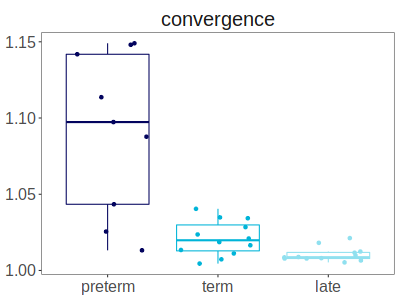
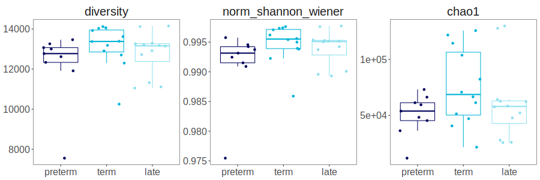
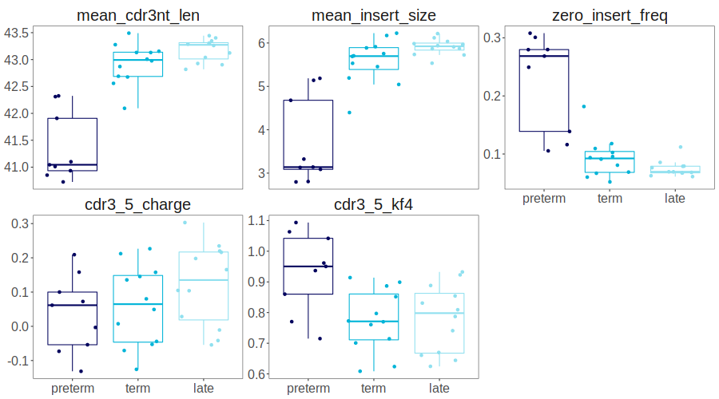

# Usage: calculating basic stats for a clonoset
[Stats](functions.md#stats) module allows to calculate various stats for all clonosets and for individual clonosets.

## Working with clonosets

To read all clonosets (.tsv format, MiXCR3/4 typical output names, VDJtools or Bioadaptive formats) in a directory or several directories, use `find_all_exported_clonosets`. 

```py
from repseq import clonosets as cl
from repseq import stats
from repseq import clone_filter as clf
from repseq import io as repseqio
from repseq import vdjtools

clonosets_dir_or_dirs = '/home/user/sample/mixcr'
clonosets = cl.find_all_exported_clonosets(clonosets_dir_or_dirs).sort_values(by="sample_id").reset_index(drop=True)
```

Output table example:

|    | sample_id           | chain   | filename                                                                   |
|---:|:------------------  |:--------|:---------------------------------------------------------------------------|
|  0 | sample_1_nCD4_1_TRB | TRB     | /home/user/samples/mixcr/sample_1_nCD4_1_TRB.clones_TRB.tsv                |
|  1 | sample_2_nCD4_1_TRB | TRB     | /home/user/samples/mixcr/sample_2_nCD4_1_TRB.clones_TRB.tsv                |
|  2 | sample_3_nCD4_1_TRB | TRB     | /home/user/samples/mixcr/sample_3_nCD4_1_TRB.clones_TRB.tsv                |


## VDJtools

<br>To convert clonosets (in a form of a dataframe) to VDJtools format, use:

```py
vdjtools.save_to_vdjtools(clonosets, "/home/user/samples/vdjtools_folder/")
```

## Reading a single clonoset into pd.DataFrame

<br>To read a single clonoset in a tab-separated format (.tsv, .txt, .tsv.gz or .zip (reads the first file)) format, use `read_clonoset` function from `io` module:
```py
clonoset_df = repseqio.read_clonoset(path_to_clonoset)
```

## Filtering clonosets
Filter is a special object, that may be used as a setup for Postanalysis. You can easily create or change it and put as an argument to other functions for individual clonoset or multi-clonoset metrics.  For `functionality`, possible values are: 

* `a` - any (default). No clones are filtered out.
* `f` - only functional. Those not having stop codons and frameshifts in CDR3 regions, or having non-empty values in CDR3 amino-acid sequence.
* `n` - only-nonfunctional - opposite to `f` - functional.

<br> Other commonly used parameters:

* Using `seed` is highly advised when using top and downsample filters. Setting a specific value ensures the reproducibility as these filters use [pseudorandom number generation](https://en.wikipedia.org/wiki/Pseudorandom_number_generator).
* With `by_umi` = True, Filter() uses counts based on UMI if the corresponding columns are present; otherwise, counts are based on reads.
* `mix_tails` = True is recommended for top filter, as sorting with identical counts may not be random.

<br>To see all possible parameters and their description, visit clone_filter [module description](functions.md#clone_filter).

<br>Most commonly used filters:

* by functionality: only functional clones (no frameshifts and stops), counts by UMI
```py
func_filter = clf.Filter(functionality="f", by_umi=True)
```

* by functionality, takes top clonotypes by UMI count. `Seed` parameter is used for reproducibility
```py
top_filter = clf.Filter(functionality="f", top=4000, by_umi=True, mix_tails=True, seed=100)
```

*  by functionality, count by UMI, randomly samples a clonoset down to 15000 UMI 
```py 
downsample_filter = clf.Filter(functionality="f", downsample=15000, by_umi=True, seed=100)
```

* by functionality, all clonotypes with UMI count less than `count_threshold` will be filtered out
```py
count_threshold_filter = clf.Filter(functionality="f", count_threshold=3, by_umi=True)
```

<br> Filtering a clonoset:
```py
filtered_clonoset_df = top_filter.apply(clonoset_df)
```

## Clonoset stats

Calc stats for clonoset size in clones, reads and UMIs

```py
clonoset_stats = stats.calc_clonoset_stats(clonosets)
```

|    | sample_id          | chain   |   clones |   clones_func |   clones_func_singletons |   clones_func_non_singletons |   clones_nonfunc |   clones_nonfunc_freq |   reads |   reads_func |   reads_nonfunc |   reads_nonfunc_freq |    umi |   umi_func |   umi_nonfunc |   umi_nonfunc_freq |
|---:|:-------------------|:--------|---------:|--------------:|-------------------------:|-----------------------------:|-----------------:|----------------------:|--------:|-------------:|----------------:|---------------------:|-------:|-----------:|--------------:|-------------------:|
|  0 | sample1_nCD4_1_TRB | TRB     |   145012 |        135644 |                    49523 |                        86121 |             9368 |             0.0646016 | 1566949 |      1509856 |           57093 |            0.0364358 | 349587 |     337223 |         12364 |          0.0353674 |
|  1 | sample2_nCD4_1_TRB | TRB     |   134150 |        126556 |                    48485 |                        78071 |             7594 |             0.0566083 |  772217 |       746989 |           25228 |            0.0326696 | 312575 |     302754 |          9821 |          0.0314197 |
|  2 | sample3_nCD4_1_TRB | TRB     |    68965 |         64585 |                    24802 |                        39783 |             4380 |             0.0635105 |  793340 |       766721 |           26619 |            0.0335531 | 163789 |     158403 |          5386 |          0.0328838 |

<br>Calculating CDR3 properties. In this example, only functional clonotypes (=no frameshifts or stops) are used.

basic stats for CDR3 regions. CDR3 amino acid sequence properties (both full sequence and central 5-residue sequence (closer to N-term in case of even length))

```py
func_filter = clf.Filter(functionality="f", by_umi=True)
cdr3_properties = stats.calc_cdr3_properties(clonosets, cl_filter=func_filter)
```

|    | sample_id          | chain   |   mean_cdr3nt_len |   mean_insert_size |   zero_insert_freq |   mean_frequency |   cdr3_5_hydropathy |   cdr3_full_hydropathy |   cdr3_5_charge |   cdr3_full_charge |   cdr3_5_polarity |   cdr3_full_polarity |   cdr3_5_volume |   cdr3_full_volume |   cdr3_5_strength |   cdr3_full_strength |   cdr3_5_mjenergy |   cdr3_full_mjenergy |   cdr3_5_kf1 |   cdr3_full_kf1 |   cdr3_5_kf2 |   cdr3_full_kf2 |   cdr3_5_kf3 |   cdr3_full_kf3 |   cdr3_5_kf4 |   cdr3_full_kf4 |   cdr3_5_kf5 |   cdr3_full_kf5 |   cdr3_5_kf6 |   cdr3_full_kf6 |   cdr3_5_kf7 |   cdr3_full_kf7 |   cdr3_5_kf8 |   cdr3_full_kf8 |   cdr3_5_kf9 |   cdr3_full_kf9 |   cdr3_5_kf10 |   cdr3_full_kf10 |   cdr3_5_rim |   cdr3_full_rim |   cdr3_5_surface |   cdr3_full_surface |   cdr3_5_turn |   cdr3_full_turn |   cdr3_5_alpha |   cdr3_full_alpha |   cdr3_5_beta |   cdr3_full_beta |   cdr3_5_core |   cdr3_full_core |   cdr3_5_disorder |   cdr3_full_disorder |
|---:|:-------------------|:--------|------------------:|-------------------:|-------------------:|-----------------:|--------------------:|-----------------------:|----------------:|-------------------:|------------------:|---------------------:|----------------:|-------------------:|------------------:|---------------------:|------------------:|---------------------:|-------------:|----------------:|-------------:|----------------:|-------------:|----------------:|-------------:|----------------:|-------------:|----------------:|-------------:|----------------:|-------------:|----------------:|-------------:|----------------:|-------------:|----------------:|--------------:|-----------------:|-------------:|----------------:|-----------------:|--------------------:|--------------:|-----------------:|---------------:|------------------:|--------------:|-----------------:|--------------:|-----------------:|------------------:|---------------------:|
|  0 | sample1_nCD4_1_TRB | TRB     |           43.1311 |            5.91418 |          0.0669883 |      7.37224e-06 |            -3.6533  |               -3.49631 |        0.145473 |           -0.25535 |           2.47028 |              7.38906 |         457.085 |            1393.35 |          0.929842 |              4.54233 |          -14.1225 |             -44.0132 |      1.87336 |         1.88425 |     -2.91408 |        -5.49689 |    0.0863277 |       -0.583377 |     0.899116 |       -0.293989 |    -1.00823  |        -2.86921 |     -1.18772 |        -1.7715  |     0.94773  |        0.770087 |      1.27514 |        0.193953 |     -1.9049  |      -0.106618  |      0.368452 |         -1.06328 |     0.306982 |        0.767234 |         0.310197 |            0.797021 |       5.81511 |          14.9261 |        4.4949  |           14.1549 |       4.83404 |          14.1038 |      0.290491 |         0.776406 |           2.31293 |              2.60787 |
|  1 | sample2_nCD4_1_TRB | TRB     |           42.6894 |            5.45495 |          0.0937428 |      7.90164e-06 |            -3.63854 |               -3.7497  |       -0.070658 |           -0.65764 |           2.52354 |              7.43611 |         453.382 |            1376.69 |          0.954769 |              4.53017 |          -14.1263 |             -43.5042 |      1.95697 |         1.73002 |     -2.96411 |        -5.37987 |   -0.189644  |       -1.12346  |     0.76061  |       -0.362696 |    -0.959487 |        -2.87697 |     -1.19542 |        -1.66914 |     0.654523 |        0.440107 |      1.30386 |        0.341753 |     -1.90955 |      -0.0793168 |      0.297878 |         -1.35161 |     0.306715 |        0.760597 |         0.310945 |            0.791057 |       5.87189 |          14.8052 |        4.49732 |           14.0927 |       4.81489 |          13.9093 |      0.289834 |         0.766072 |           2.2879  |              2.64048 |
|  2 | sample3_nCD4_1_TRB | TRB     |           43.1306 |            5.53264 |          0.109455  |      1.54835e-05 |            -3.5389  |               -3.36705 |        0.226643 |           -0.13198 |           2.45753 |              7.38413 |         463.875 |            1401.24 |          1.01215  |              4.64907 |          -14.3082 |             -44.2336 |      1.88087 |         1.95313 |     -2.68089 |        -5.22143 |    0.141751  |       -0.455098 |     0.772542 |       -0.446082 |    -1.0089   |        -2.85593 |     -1.24996 |        -1.84142 |     0.968762 |        0.771571 |      1.23777 |        0.206734 |     -1.78501 |       0.0142436 |      0.431144 |         -1.00567 |     0.302192 |        0.761093 |         0.305975 |            0.791293 |       5.76219 |          14.8705 |        4.50163 |           14.148  |       4.8573  |          14.1363 |      0.29094  |         0.777235 |           2.11711 |              2.3694  |

<br>Calculating [diversity](https://mixcr.com/mixcr/reference/mixcr-postanalysis/#diversity-measures) stats. It includes observed diversity, Shannon-Wiener, normalized Shannon-Wiener and chao1 index for each clonoset in clonosets_df. Here, a top_n filter is applied.

```py
diversity_stats = stats.calc_diversity_stats(clonosets, cl_filter=downsample_filter, seed=123)
```

|    | sample_id          | chain   |   shannon_wiener |   norm_shannon_wiener |   diversity |   clonality |    chao1 |
|---:|:-------------------|:--------|-----------------:|----------------------:|------------:|------------:|---------:|
|  0 | sample1_nCD4_1_TRB | TRB     |          9.53229 |              0.997617 |       14116 |  0.00238349 | 125744   |
|  1 | sample2_nCD4_1_TRB | TRB     |          9.52557 |              0.997336 |       14059 |  0.00266397 | 121758   |
|  2 | sample3_nCD4_1_TRB | TRB     |          9.43915 |              0.994989 |       13183 |  0.005011   |  61315.5 |


<br>Calculating convergence (=the number of unique CDR3 nucleotide sequences that code for the same amino acid sequence) for each clonoset in clonosets_df. 
```py
convergence = stats.calc_convergence(clonosets, cl_filter=top_filter)
```

|    | sample_id          | chain   |   convergence |
|---:|:-------------------|:--------|--------------:|
|  0 | sample1_nCD4_1_TRB | TRB     |       1.01114 |
|  1 | sample2_nCD4_1_TRB | TRB     |       1.03426 |
|  2 | sample3_nCD4_1_TRB | TRB     |       1.02362 |

<br>Segment usage (combined frequency of segments) can be calculated for V/J/C-segments. All possible options are ["v", "j", "c", "vj", "vlen", "vjlen"]. `vj` - usage of combinations of `v` and `j` segments. `vlen` and `vjlen` options also take the length of amimo acid CDR3 length into account and calculate usage for particular combination.

The result can be outputted in `long` or `wide` format:

- `long` - four columns: `sample_id`, `chain`, `<segment_type>`, `usage`
- `wide` - num of rows equals to the number of input clonosets, and all segments are the columns and usage is in each cell.https://www.sciencedirect.com/science/article/pii/S0958166920301051

```py
v_usage = stats.calc_segment_usage(clonosets, segment="v", cl_filter=func_filter, table="long")
```

## Custom stats

Stats module has a special function `generic_calculation` which performs multiple individual clonoset statistic calculation. It runs all individual clonoset calculations in parallel.

**Instruction**:

* First, create a `function_name_cl` which performs individual clonoset calculation;
* Create a main wrapper function named `function_name`, which passes `function_name_cl` and `clonosets_df` to `generic_calculation`.

In this example, Crohn's-associated invariant T cells (CAITs) are identified across clonosets.

```py
import re

def find_caits(clonosets_df, cl_filter=None):
    df = stats.generic_calculation(clonosets_df, find_caits_cl, clonoset_filter=cl_filter, program_name="Find CAITs")
    return df

def find_caits_cl(clonoset_in, colnames=None):
    clonoset = clonoset_in.copy()
    
    # find colnames for freq, count, v, j and so on
    if colnames is None:
        colnames = cl.get_column_names_from_clonoset(clonoset)
    
    # create a motif to search for
    cait_motif = re.compile(r'CVV[A-Z]{2}A[A-Z]{1}GGSYIPTF')
    trav = "TRAV12-1"
    traj = "TRAJ6"
    
    # perform calculation of motif abundance
    clonoset["cait_cdr3aa"] = clonoset[colnames["cdr3aa_column"]].apply(lambda x: cait_motif.search(x) is not None)

    clonoset = clonoset.loc[clonoset[colnames["v_column"]] == trav]
    trav_freq = clonoset[colnames["fraction_column"]].sum()

    clonoset = clonoset.loc[clonoset[colnames["j_column"]] == traj]
    trav_traj_freq = clonoset[colnames["fraction_column"]].sum()

    clonoset = clonoset.loc[clonoset["cait_cdr3aa"]]
    cait_freq = clonoset[colnames["fraction_column"]].sum()
    cait_clonotypes = len(clonoset)
    
    # save it to dictionary
    result_dict = {"cait_clonotypes": cait_clonotypes,
                   "cait_freq": cait_freq,
                   "trav12_1_freq": trav_freq,
                   "v12_1_j6_freq": trav_traj_freq}
    
    return result_dict

tra_clonosets = cl.find_all_exported_clonosets("/projects/cdr3_common/repseq_demo/custom_stats_clonosets/")
clonoset_caits = find_caits(tra_clonosets, cl_filter=func_filter)
```

|    | sample_id          | chain   |   cait_clonotypes |   cait_freq |   trav12_1_freq |   v12_1_j6_freq |
|---:|:-------------------|:--------|------------------:|------------:|----------------:|----------------:|
|  0 | sample1_nCD4_1_TRB | TRA     |                 4 | 7.93676e-05 |       0.0382234 |      0.00144449 |
|  1 | sample2_nCD4_1_TRB | TRA     |                 1 | 3.55821e-05 |       0.0360803 |      0.00170794 |
|  2 | sample3_nCD4_1_TRB | TRA     |                 5 | 0.000124894 |       0.0386671 |      0.002348   |


??? info "Convergence visualization"
    Calculated stats can be visualized in Jupyter notebook using %%R cell magic. 
    
    
    ```py
    %load_ext rpy2.ipython
    %%R -i convergence,metadata -w 400 -h 300

    params_order <- c("convergence")

    convergence %>%
        merge(metadata) %>%
        select(sample_id, experimental_group, subset, convergence) %>%
        pivot_longer(-c(sample_id, experimental_group, subset), names_to="parameter", values_to="value") %>%
        mutate(experimental_group=factor(experimental_group, group_order)) %>%
        mutate(parameter=factor(parameter, params_order)) %>%
        ggplot(aes(x=experimental_group, y=value, color=experimental_group)) +
            geom_boxplot(outlier.shape=NA)+
            geom_jitter()+
            facet_wrap(vars(parameter), scales="free_y")+
            scale_color_manual(values=colors_6_groups) + 
            boxplot_theme+
            theme(legend.position="none")
    ```

??? info "Diversity visualization"
    Calculated stats can be visualized in Jupyter notebook using %%R cell magic. 
    
    
    ```py
    %load_ext rpy2.ipython
    %%R -i diversity_stats,metadata -w 900 -h 300

    params_order <- c("diversity", "norm_shannon_wiener", "chao1")

    diversity_stats %>%
        merge(metadata) %>%
        select(sample_id, experimental_group, subset, diversity, norm_shannon_wiener, chao1) %>%
        pivot_longer(-c(sample_id, experimental_group, subset), names_to="parameter", values_to="value") %>%
        mutate(experimental_group=factor(experimental_group, group_order)) %>%
        mutate(parameter=factor(parameter, params_order)) %>%
        ggplot(aes(x=experimental_group, y=value, color=experimental_group)) +
            geom_boxplot(outlier.shape=NA)+
            geom_jitter()+
            facet_wrap(vars(parameter), scales="free_y")+
            scale_color_manual(values=colors_6_groups) + 
            boxplot_theme+
            theme(legend.position="none")
    ```

??? info "CDR3 properties visualization"
    Calculated stats can be visualized in Jupyter notebook using %%R cell magic. 
    
    
    ```py
    %load_ext rpy2.ipython
    %%R -i cdr3_properties,metadata -w 900 -h 500

    params_order <- c("mean_cdr3nt_len", "mean_insert_size", "zero_insert_freq", "cdr3_5_charge", "cdr3_5_kf4")

    cdr3_properties %>%
        merge(metadata) %>%
        select(sample_id, experimental_group, subset, mean_cdr3nt_len, mean_insert_size, zero_insert_freq, cdr3_5_charge, cdr3_5_kf4) %>%
        pivot_longer(-c(sample_id, experimental_group, subset), names_to="parameter", values_to="value") %>%
        mutate(experimental_group=factor(experimental_group, group_order)) %>%
        mutate(parameter=factor(parameter, params_order)) %>%
        ggplot(aes(x=experimental_group, y=value, color=experimental_group)) +
            geom_boxplot(outlier.shape=NA)+
            geom_jitter()+
            facet_wrap(vars(parameter), scales="free_y")+
            scale_color_manual(values=colors_6_groups) + 
            boxplot_theme+
            theme(legend.position="none")
    ```


??? info "V-segment usage visualization"
    Calculated stats can be visualized in Jupyter notebook using %%R cell magic. 
    
    
    ```py
    %load_ext rpy2.ipython
    %%R -i v_usage,metadata -w 1200 -h 600

    v_usage_order <- v_usage %>% select(v) %>% distinct() %>%
      separate(v, into = c("f", "l"), remove = F, convert = T) %>%
      separate(f, into = c("s", "n"), remove = T, convert = T, sep="V") %>%
      arrange(n,l) %>% pull(v)

    v_usage %>%
        merge(metadata) %>%
        mutate(v=factor(v, v_usage_order)) %>%
        ggplot(aes(x=v, y=usage, fill=experimental_group)) +
            stat_summary(fun.data=mean_se, geom="errorbar", position="dodge")+
            stat_summary(fun=mean, geom="col", position="dodge")+
            theme_bw()+
            theme(
                text = element_text(size=14),
              axis.text.x = element_text(size=14,angle=90, vjust=0.5, hjust=1),
              axis.text.y = element_text(size=14),
              axis.title.x = element_blank(),
              plot.title = element_text(hjust = 0.5),
              panel.grid = element_blank(),
              legend.position = "bottom"
            )+
            ggtitle("nCD4 V-usage")+
            scale_fill_manual(values = colors_6_groups)
    ```