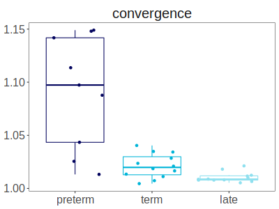
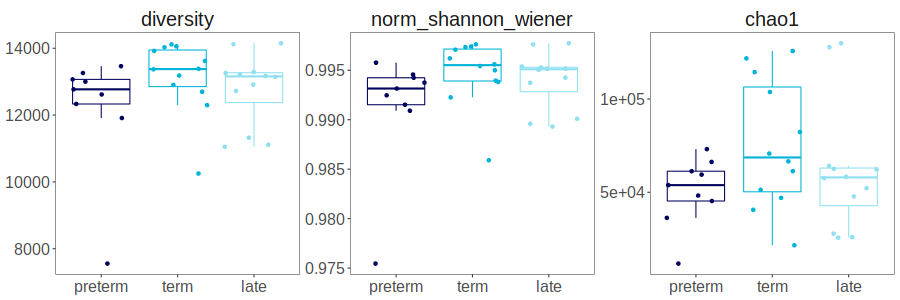
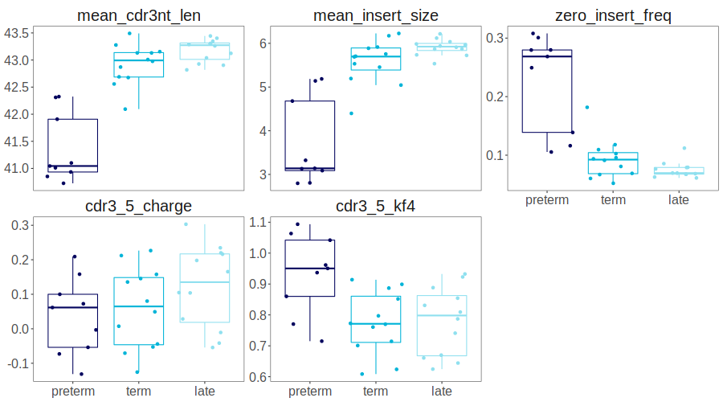
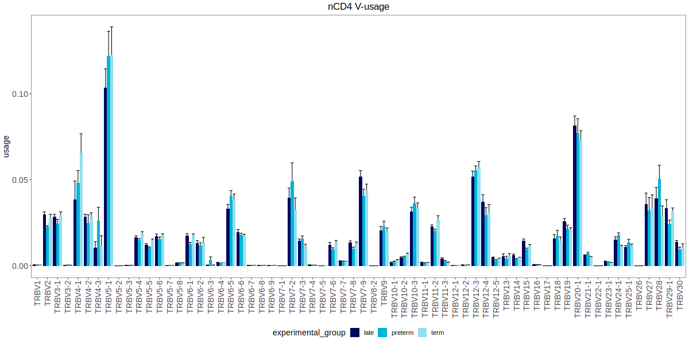

# Usage: calculating basic stats for a clonoset
[Stats](functions.md#stats) module allows to calculate various stats for all clonosets and for individual clonosets.

## Working with clonosets

To read all clonosets (.tsv format, MiXCR3/4 typical output names, VDJtools or Bioadaptive formats) in a directory or several directories, use `find_all_mixcr_clonosets`. 

```py
from repseq import clonosets as cl
from repseq import stats
from repseq import clone_filter as clf
from repseq import io as repseqio

clonosets_dir_or_dirs = '/home/user/sample/mixcr'
clonosets = cl.find_all_mixcr_clonosets(clonosets_dir_or_dirs).sort_values(by="sample_id").reset_index(drop=True)
```

Output table example:

|    | sample_id           | chain   | filename                                                                   |
|---:|:------------------  |:--------|:---------------------------------------------------------------------------|
|  0 | sample_1_nCD4_1_TRB | TRB     | /home/user/samples/mixcr/sample_1_nCD4_1_TRB.clones_TRB.tsv                |
|  1 | sample_2_nCD4_1_TRB | TRB     | /home/user/samples/mixcr/sample_2_nCD4_1_TRB.clones_TRB.tsv                |
|  2 | sample_3_nCD4_1_TRB | TRB     | /home/user/samples/mixcr/sample_3_nCD4_1_TRB.clones_TRB.tsv                |


## VDJtools

<br>To convert clonosets (in a form of a dataframe) to VDJtools format, use:

```py
repseqio.save_to_vdjtools(clonosets, "/home/user/samples/vdjtools_folder/")
```

## Reading a single clonoset into pd.DataFrame

<br>To read a single clonoset in a tab-separated format (.tsv, .txt, .tsv.gz or .zip (reads the first file)) format, use `read_clonoset` function from `io` module:
```py
clonoset_df = repseqio.read_clonoset(path_to_clonoset)
```

## Filtering clonosets
Filter is a special object, that may be used as a setup for Postanalysis. You can easily create or change it and put as an argument to other functions for individual clonoset or multi-clonoset metrics.  For `functionality`, possible values are: 

* `a` - any (default). No clones are filtered out.
* `f` - only functional. Those not having stop codons and frameshifts in CDR3 regions, or having non-empty values in CDR3 amino-acid sequence.
* `n` - only-nonfunctional - opposite to `f` - functional.

<br> Other commonly used parameters:

* Using `seed` is highly advised when using top and downsample filters. Setting a specific value ensures the reproducibility as these filters use [pseudorandom number generation](https://en.wikipedia.org/wiki/Pseudorandom_number_generator).
* With `by_umi` = True, Filter() uses counts based on UMI if the corresponding columns are present; otherwise, counts are based on reads.
* `mix_tails` = True is recommended for top filter, as sorting with identical counts may not be random.

<br>To see all possible parameters and their description, visit clone_filter [module description](functions.md#clone_filter).

<br>Most commonly used filters:

* by functionality: only functional clones (no frameshifts and stops), counts by UMI
```py
func_filter = clf.Filter(functionality="f", by_umi=True)
```

* by functionality, takes top clonotypes by UMI count. `Seed` parameter is used for reproducibility
```py
top_filter = clf.Filter(functionality="f", top=4000, by_umi=True, mix_tails=True, seed=100)
```

*  by functionality, count by UMI, randomly samples a clonoset down to 15000 UMI 
```py 
downsample_filter = clf.Filter(functionality="f", downsample=15000, by_umi=True, seed=100)
```

* by functionality, all clonotypes with UMI count less than `count_threshold` will be filtered out
```py
count_threshold_filter = clf.Filter(functionality="f", count_threshold=3, by_umi=True)
```

### White-list and black-list clonotype rules

`white_list` keeps only matching clonotypes. `black_list` removes matching
clonotypes. If both are provided, `white_list` is applied first and
`black_list` second.

Rules can use the old tuple syntax:

```py
# exact CDR3 amino-acid sequence
clf.Filter(white_list=[("CASSLGQETQYF",)])

# exact CDR3 amino-acid sequence + V
clf.Filter(white_list=[("CASSLGQETQYF", "TRBV7-8")])

# exact CDR3 amino-acid sequence + V + J
clf.Filter(white_list=[("CASSLGQETQYF", "TRBV7-8", "TRBJ2-5")])
```

Tuple positions can be ignored with `None` or an empty string. The positions are
always interpreted as `(cdr3aa, v, j)`.

```py
# only exact V
clf.Filter(white_list=[(None, "TRBV7-8")])

# exact V + J, any CDR3 amino-acid sequence
clf.Filter(white_list=[(None, "TRBV7-8", "TRBJ2-5")])

# exact CDR3 amino-acid sequence + J, any V
clf.Filter(white_list=[("CASSLGQETQYF", None, "TRBJ2-5")])
```

New dictionary rules are more flexible. Keys are clonoset columns such as
`cdr3aa`, `cdr3nt`, `v`, `d`, `j`, `c`, `count`, or `freq`. Conditions inside
one dictionary are combined with AND; separate dictionaries in the list are
combined with OR.

Exact V segment:

```py
clf.Filter(white_list=[{"v": "TRBV7-8"}])
```

Several exact V segments:

```py
clf.Filter(white_list=[{"v": ["TRBV7-8", "TRBV7-3"]}])
```

V family by substring:

```py
clf.Filter(white_list=[{"v": {"contains": "TRBV7"}}])
```

Wildcard matching:

```py
clf.Filter(white_list=[{"v": "TRBV7*"}])
clf.Filter(white_list=[{"cdr3aa": "CASS*QYF"}])
```

Regular expressions and PSI-BLAST-like bracket expressions:

```py
clf.Filter(white_list=[{"cdr3aa": {"regex": r"CASS[A-Z]{2,5}QYF"}}])
clf.Filter(white_list=[{"cdr3aa": {"pattern": r"CASS[ST]G[DE]QYF"}}])
```

Combined CDR3 nucleotide + V:

```py
clf.Filter(white_list=[{"cdr3nt": "TGTGCCAGCAGC", "v": "TRBV7-8"}])
```

Combined CDR3 amino-acid + V + J:

```py
clf.Filter(white_list=[{"cdr3aa": "CASSLGQETQYF", "v": "TRBV7-8", "j": "TRBJ2-5"}])
```

V family plus CDR3 amino-acid pattern:

```py
clf.Filter(
    white_list=[
        {
            "v": {"contains": "TRBV7"},
            "cdr3aa": {"regex": r"CASS.*QYF"},
        }
    ]
)
```

Black-list rules use the same syntax:

```py
clf.Filter(black_list=[{"v": {"contains": "TRBV7"}}])
clf.Filter(black_list=[{"cdr3aa": "CASS*"}])
```

<br> Filtering a clonoset:
```py
filtered_clonoset_df = top_filter.apply(clonoset_df)
```

## Clonoset stats

Calc stats for clonoset size in clones, reads and UMIs

```py
clonoset_stats = stats.calc_clonoset_stats(clonosets)
```

|    | sample_id          | chain   |   clones |   clones_func |   clones_func_singletons |   clones_func_non_singletons |   clones_nonfunc |   clones_nonfunc_freq |   reads |   reads_func |   reads_nonfunc |   reads_nonfunc_freq |    umi |   umi_func |   umi_nonfunc |   umi_nonfunc_freq |
|---:|:-------------------|:--------|---------:|--------------:|-------------------------:|-----------------------------:|-----------------:|----------------------:|--------:|-------------:|----------------:|---------------------:|-------:|-----------:|--------------:|-------------------:|
|  0 | sample1_nCD4_1_TRB | TRB     |   145012 |        135644 |                    49523 |                        86121 |             9368 |             0.0646016 | 1566949 |      1509856 |           57093 |            0.0364358 | 349587 |     337223 |         12364 |          0.0353674 |
|  1 | sample2_nCD4_1_TRB | TRB     |   134150 |        126556 |                    48485 |                        78071 |             7594 |             0.0566083 |  772217 |       746989 |           25228 |            0.0326696 | 312575 |     302754 |          9821 |          0.0314197 |
|  2 | sample3_nCD4_1_TRB | TRB     |    68965 |         64585 |                    24802 |                        39783 |             4380 |             0.0635105 |  793340 |       766721 |           26619 |            0.0335531 | 163789 |     158403 |          5386 |          0.0328838 |

<br>Calculating CDR3 properties. In this example, only functional clonotypes (=no frameshifts or stops) are used.

basic stats for CDR3 regions. CDR3 amino acid sequence properties (both full sequence and central 5-residue sequence (closer to N-term in case of even length))

```py
func_filter = clf.Filter(functionality="f", by_umi=True)
cdr3_properties = stats.calc_cdr3_properties(clonosets, cl_filter=func_filter)
```

|    | sample_id          | chain   |   mean_cdr3nt_len |   mean_insert_size |   zero_insert_freq |   mean_frequency |   cdr3_5_hydropathy |   cdr3_full_hydropathy |   cdr3_5_charge |   cdr3_full_charge |   cdr3_5_polarity |   cdr3_full_polarity |   cdr3_5_volume |   cdr3_full_volume |   cdr3_5_strength |   cdr3_full_strength |   cdr3_5_mjenergy |   cdr3_full_mjenergy |   cdr3_5_kf1 |   cdr3_full_kf1 |   cdr3_5_kf2 |   cdr3_full_kf2 |   cdr3_5_kf3 |   cdr3_full_kf3 |   cdr3_5_kf4 |   cdr3_full_kf4 |   cdr3_5_kf5 |   cdr3_full_kf5 |   cdr3_5_kf6 |   cdr3_full_kf6 |   cdr3_5_kf7 |   cdr3_full_kf7 |   cdr3_5_kf8 |   cdr3_full_kf8 |   cdr3_5_kf9 |   cdr3_full_kf9 |   cdr3_5_kf10 |   cdr3_full_kf10 |   cdr3_5_rim |   cdr3_full_rim |   cdr3_5_surface |   cdr3_full_surface |   cdr3_5_turn |   cdr3_full_turn |   cdr3_5_alpha |   cdr3_full_alpha |   cdr3_5_beta |   cdr3_full_beta |   cdr3_5_core |   cdr3_full_core |   cdr3_5_disorder |   cdr3_full_disorder |
|---:|:-------------------|:--------|------------------:|-------------------:|-------------------:|-----------------:|--------------------:|-----------------------:|----------------:|-------------------:|------------------:|---------------------:|----------------:|-------------------:|------------------:|---------------------:|------------------:|---------------------:|-------------:|----------------:|-------------:|----------------:|-------------:|----------------:|-------------:|----------------:|-------------:|----------------:|-------------:|----------------:|-------------:|----------------:|-------------:|----------------:|-------------:|----------------:|--------------:|-----------------:|-------------:|----------------:|-----------------:|--------------------:|--------------:|-----------------:|---------------:|------------------:|--------------:|-----------------:|--------------:|-----------------:|------------------:|---------------------:|
|  0 | sample1_nCD4_1_TRB | TRB     |           43.1311 |            5.91418 |          0.0669883 |      7.37224e-06 |            -3.6533  |               -3.49631 |        0.145473 |           -0.25535 |           2.47028 |              7.38906 |         457.085 |            1393.35 |          0.929842 |              4.54233 |          -14.1225 |             -44.0132 |      1.87336 |         1.88425 |     -2.91408 |        -5.49689 |    0.0863277 |       -0.583377 |     0.899116 |       -0.293989 |    -1.00823  |        -2.86921 |     -1.18772 |        -1.7715  |     0.94773  |        0.770087 |      1.27514 |        0.193953 |     -1.9049  |      -0.106618  |      0.368452 |         -1.06328 |     0.306982 |        0.767234 |         0.310197 |            0.797021 |       5.81511 |          14.9261 |        4.4949  |           14.1549 |       4.83404 |          14.1038 |      0.290491 |         0.776406 |           2.31293 |              2.60787 |
|  1 | sample2_nCD4_1_TRB | TRB     |           42.6894 |            5.45495 |          0.0937428 |      7.90164e-06 |            -3.63854 |               -3.7497  |       -0.070658 |           -0.65764 |           2.52354 |              7.43611 |         453.382 |            1376.69 |          0.954769 |              4.53017 |          -14.1263 |             -43.5042 |      1.95697 |         1.73002 |     -2.96411 |        -5.37987 |   -0.189644  |       -1.12346  |     0.76061  |       -0.362696 |    -0.959487 |        -2.87697 |     -1.19542 |        -1.66914 |     0.654523 |        0.440107 |      1.30386 |        0.341753 |     -1.90955 |      -0.0793168 |      0.297878 |         -1.35161 |     0.306715 |        0.760597 |         0.310945 |            0.791057 |       5.87189 |          14.8052 |        4.49732 |           14.0927 |       4.81489 |          13.9093 |      0.289834 |         0.766072 |           2.2879  |              2.64048 |
|  2 | sample3_nCD4_1_TRB | TRB     |           43.1306 |            5.53264 |          0.109455  |      1.54835e-05 |            -3.5389  |               -3.36705 |        0.226643 |           -0.13198 |           2.45753 |              7.38413 |         463.875 |            1401.24 |          1.01215  |              4.64907 |          -14.3082 |             -44.2336 |      1.88087 |         1.95313 |     -2.68089 |        -5.22143 |    0.141751  |       -0.455098 |     0.772542 |       -0.446082 |    -1.0089   |        -2.85593 |     -1.24996 |        -1.84142 |     0.968762 |        0.771571 |      1.23777 |        0.206734 |     -1.78501 |       0.0142436 |      0.431144 |         -1.00567 |     0.302192 |        0.761093 |         0.305975 |            0.791293 |       5.76219 |          14.8705 |        4.50163 |           14.148  |       4.8573  |          14.1363 |      0.29094  |         0.777235 |           2.11711 |              2.3694  |

<br>Calculating [diversity](https://mixcr.com/mixcr/reference/mixcr-postanalysis/#diversity-measures) stats. Here, a top_n filter is applied.

```py
diversity_stats = stats.calc_diversity_stats(clonosets, cl_filter=downsample_filter, seed=123)
```

The first diversity columns are kept in this order for backwards-compatible
summary tables: `diversity`, `norm_shannon_wiener`, `clonality`,
`shannon_wiener`, `chao1`. Additional richness, evenness, and dominance
metrics are appended after them.

| metric | description | formula |
|:--|:--|:--|
| `diversity` | Observed richness; number of clonotypes with non-zero count. | `S_obs` |
| `norm_shannon_wiener` | Normalized Shannon-Wiener evenness. | `H / ln(S_obs)` |
| `clonality` | Shannon-based clonality. Values near 1 indicate dominance by few clonotypes. | `1 - H / ln(S_obs)` |
| `shannon_wiener` | Shannon-Wiener entropy. | `H = -sum(p_i ln p_i)` |
| `chao1` | Bias-corrected Chao1 richness estimator. | `S_obs + f1 * (f1 - 1) / (2 * (f2 + 1))` |
| `richness` | Alias of observed richness. | `S_obs` |
| `ace` | Abundance-based Coverage Estimator using rare clonotypes with count <= 10. | `S_abund + S_rare / C_ACE + f1 * gamma_ACE^2 / C_ACE` |
| `goods_coverage` | Good's coverage, estimated sampled repertoire coverage. | `1 - f1 / N` |
| `d50` | Fraction of clonotypes needed to account for at least 50% of counts. | `min(k: sum_{i=1..k} n_i >= N/2) / S_obs`, counts sorted descending |
| `simpson` | Simpson dominance index. | `sum(p_i^2)` |
| `inverse_simpson` | Effective diversity from Simpson index. | `1 / sum(p_i^2)` |
| `gini_simpson` | Gini-Simpson diversity index. | `1 - sum(p_i^2)` |
| `berger_parker` | Berger-Parker dominance index. | `max(p_i)` |
| `gini_coefficient` | Inequality of clonotype counts. | `(2 * sum(i * n_i)) / (S_obs * N) - (S_obs + 1) / S_obs`, counts sorted ascending |

Here `n_i` is a clonotype count, `p_i = n_i / N`, `N = sum(n_i)`,
`S_obs` is observed richness, `f1` is the number of singleton clonotypes, and
`f2` is the number of doubletons.


## Rarefaction curves

`stats.calc_rarefaction_points` calculates observed clonotype diversity after
repeated count downsampling. `cl_filter` is applied first, so all rarefaction
depths refer to the filtered repertoire. The default three iterations use
distinct deterministic seeds derived from `seed=0`.

Depths are spaced by half an order of magnitude: 32, 100, 316, 1000, 3162,
and so on. Only depths below the filtered total count are downsampled. The final
point is always the full filtered count and its exact observed diversity. For a
sample with fewer than 32 counts, only that final point is returned.

```py
rarefaction = stats.calc_rarefaction_points(
    sample_df=clonosets,
    cl_filter=func_filter,
    iterations=3,
    seed=0,
    cpu=4,
)
```

The output is a long table with `sample_id`, optional `chain`,
`rarefaction_depth`, and `diversity` columns:

| sample_id | chain | rarefaction_depth | diversity |
|:----------|:------|------------------:|----------:|
| sample1   | TRB   |                32 |      24.7 |
| sample1   | TRB   |               100 |      61.3 |
| sample1   | TRB   |               316 |     142.0 |
| sample1   | TRB   |              1000 |     286.0 |

Plot the result with `rsplot.rarefaction_curve`:

```py
from repseq import plot as rsplot

fig = rsplot.rarefaction_curve(rarefaction)
```

The x-axis is logarithmic by default. The legend is placed to the right of the
plot. For up to 20 curves, the default uses a fixed high-contrast categorical
palette rather than a gradient; pass `palette=` to override it. When one
`sample_id` has several unique chains, curves are labeled as `sample_id(chain)`,
for example `ucb_ntreg(TRA)` and `ucb_ntreg(TRB)`. Set `log_x=False` for a
linear x-axis.


<br>Calculating convergence for each clonoset in `clonosets_df`. For the
most honest comparison, use equal downsampling across samples; this is preferred
to top-N filtering and much preferred to calculations without normalization.
The output includes:

- `convergence`: unique CDR3 nucleotide sequences divided by unique CDR3 amino-acid sequences.
- `convergence_v`: unique CDR3 nucleotide + V combinations divided by unique CDR3 amino-acid + V combinations.
- `convergence_vj`: unique CDR3 nucleotide + V + J combinations divided by unique CDR3 amino-acid + V + J combinations.

```py
convergence = stats.calc_convergence(clonosets, cl_filter=top_filter)
```

|    | sample_id          | chain   |   convergence |   convergence_v |   convergence_vj |
|---:|:-------------------|:--------|--------------:|----------------:|-----------------:|
|  0 | sample1_nCD4_1_TRB | TRB     |       1.01114 |         1.01001 |          1.00851 |
|  1 | sample2_nCD4_1_TRB | TRB     |       1.03426 |         1.03084 |          1.02803 |
|  2 | sample3_nCD4_1_TRB | TRB     |       1.02362 |         1.02115 |          1.01972 |

<br>Segment usage (combined frequency of segments) can be calculated for V/J/C-segments. All possible options are ["v", "j", "c", "vj", "vlen", "vjlen"]. `vj` - usage of combinations of `v` and `j` segments. `vlen` and `vjlen` options also take the length of amimo acid CDR3 length into account and calculate usage for particular combination.

The resulting dataframe can be in either `long` or `wide` format:

- `long` - basic V/J/C usage has `sample_id`, `chain`, `<segment_type>`, and
  `usage`. V-J usage additionally has string `v`, `j`, and `vj` columns, where
  `vj` is `v|j`. V-J-length usage additionally has string `v`, `j`, `vjlen`, and
  integer `len` columns, where `vjlen` is `v|j|len`.
- `wide` - the number of rows equals the number of input clonosets. Segment or
  combination identifiers are string column names; V-J and V-J-length names use
  the same `|` separator.

```py
v_usage = stats.calc_segment_usage(clonosets, segment="v", cl_filter=func_filter, table="long")
```

<br>CDR3 length distributions can be calculated for amino-acid or nucleotide
sequences. By default, clonotype frequencies are summed; set
`count_by_freq=False` to sum counts instead.

```py
cdr3_lengths = stats.cdr3_length_distributions(
    clonosets,
    cl_filter=func_filter,
    seq_type="aa",
    table="long",
    cpu=1,
)
```

## Custom stats

Stats module has a special function `generic_calculation` which performs multiple individual clonoset statistic calculation. It runs all individual clonoset calculations in parallel.

**Instruction**:

* First, create a `function_name_cl` which performs individual clonoset calculation;
* Create a main wrapper function named `function_name`, which passes `function_name_cl` and `clonosets_df` to `generic_calculation`.

In this example, Crohn's-associated invariant T cells (CAITs) are identified across clonosets.

```py
import re

def find_caits(clonosets_df, cl_filter=None):
    df = stats.generic_calculation(clonosets_df, find_caits_cl, clonoset_filter=cl_filter, program_name="Find CAITs")
    return df

def find_caits_cl(clonoset_in, colnames=None):
    clonoset = clonoset_in.copy()
    
    # find colnames for freq, count, v, j and so on
    if colnames is None:
        colnames = cl.get_column_names_from_clonoset(clonoset)
    
    # create a motif to search for
    cait_motif = re.compile(r'CVV[A-Z]{2}A[A-Z]{1}GGSYIPTF')
    trav = "TRAV12-1"
    traj = "TRAJ6"
    
    # perform calculation of motif abundance
    clonoset["cait_cdr3aa"] = clonoset[colnames["cdr3aa_column"]].apply(lambda x: cait_motif.search(x) is not None)

    clonoset = clonoset.loc[clonoset[colnames["v_column"]] == trav]
    trav_freq = clonoset[colnames["fraction_column"]].sum()

    clonoset = clonoset.loc[clonoset[colnames["j_column"]] == traj]
    trav_traj_freq = clonoset[colnames["fraction_column"]].sum()

    clonoset = clonoset.loc[clonoset["cait_cdr3aa"]]
    cait_freq = clonoset[colnames["fraction_column"]].sum()
    cait_clonotypes = len(clonoset)
    
    # save it to dictionary
    result_dict = {"cait_clonotypes": cait_clonotypes,
                   "cait_freq": cait_freq,
                   "trav12_1_freq": trav_freq,
                   "v12_1_j6_freq": trav_traj_freq}
    
    return result_dict

tra_clonosets = cl.find_all_mixcr_clonosets("/projects/cdr3_common/repseq_demo/custom_stats_clonosets/")
clonoset_caits = find_caits(tra_clonosets, cl_filter=func_filter)
```

|    | sample_id          | chain   |   cait_clonotypes |   cait_freq |   trav12_1_freq |   v12_1_j6_freq |
|---:|:-------------------|:--------|------------------:|------------:|----------------:|----------------:|
|  0 | sample1_nCD4_1_TRB | TRA     |                 4 | 7.93676e-05 |       0.0382234 |      0.00144449 |
|  1 | sample2_nCD4_1_TRB | TRA     |                 1 | 3.55821e-05 |       0.0360803 |      0.00170794 |
|  2 | sample3_nCD4_1_TRB | TRA     |                 5 | 0.000124894 |       0.0386671 |      0.002348   |

## Plotting statistics in Python

The `plot` module provides matplotlib/seaborn wrappers for common statistics
tables. Import it as:

```py
from repseq import plot as rsplot
```

Each plotting function takes a statistics table and, optionally, a metadata
table. Metadata must contain `sample_id`; if both tables contain `chain`, the
merge uses `sample_id` + `chain`. Grouping and split columns are taken from the
metadata table. If metadata contains fewer samples than the statistics table, a
warning is shown and only the matched subset is plotted.

```py
rsplot.diversity_stats(
    diversity_stats,
    metadata=metadata,
    group="experimental_group",
)
```

If `group` is not provided, each sample is drawn as a separate bar. If one
grouping column is provided, the plot uses that column on the x-axis and draws
boxplots with jittered sample points. If two grouping columns are provided, the
first column is used on the x-axis and the second column is used for color.

```py
rsplot.cdr3aa_stats(
    cdr3_properties,
    metadata=metadata,
    group=["experimental_group", "subset"],
)
```

Use `split` to create panels. One split column creates one set of panels; two
split columns are combined into interaction panels.

```py
rsplot.diversity_stats(
    diversity_stats,
    metadata=metadata,
    group="experimental_group",
    split="chain",
)

rsplot.cdr3aa_stats(
    cdr3_properties,
    metadata=metadata,
    group="experimental_group",
    split=["chain", "subset"],
)
```

Default property panels are provided for CDR3 amino-acid properties, diversity
statistics, and convergence. You can override them with `properties`.

```py
rsplot.convergence(convergence, metadata=metadata, group="experimental_group")

rsplot.diversity_stats(
    diversity_stats,
    metadata=metadata,
    properties=["diversity", "chao1", "berger_parker"],
    group="experimental_group",
)
```

Ordered pandas categorical columns in metadata keep their order in the x-axis,
color legend, and split panels.

### Plotting segment usage

`rsplot.segment_usage` accepts both the long and wide tables returned by
`stats.calc_segment_usage`. It detects V, J, or C usage from the table and
separates chains into independent panels. Generic long tables with a `segment`
or `gene` column and a `usage`, `value`, `freq`, `frequency`, or `count` column
are accepted as well.

The default heatmap places segments in columns and samples in rows. Each chain
has its own segment and sample axes. One metadata column can be used to split
each chain into additional rows.

```py
v_usage = stats.calc_segment_usage(
    clonosets,
    segment="v",
    cl_filter=func_filter,
    table="long",
)

rsplot.segment_usage(v_usage)
rsplot.segment_usage(v_usage, metadata=metadata, split="tissue")
```

Heatmaps accept up to three metadata grouping columns. These are displayed as
vertical sample-annotation strips, and samples are hierarchically clustered by
their segment-usage profiles. Ordered categorical metadata controls annotation
colors and legend order.

```py
rsplot.segment_usage(
    v_usage,
    metadata=metadata,
    group=["experimental_group", "tissue", "sex"],
)
```

Usage heatmaps use the blue-to-red `RdBu_r` colormap by default. Pass any
Matplotlib-compatible `cmap` to override it. Annotation legends show category
values only; the metadata column names remain above the annotation strips.

Use `plot_type="barplot"` for bars. Without a group, each sample is a separate
series. With one metadata group, the bars show the group mean with sample
standard-deviation error bars.

```py
rsplot.segment_usage(
    v_usage,
    metadata=metadata,
    plot_type="barplot",
    group="experimental_group",
)
```

Use `plot_type="boxplot"` with one metadata group for boxplots and
deterministically jittered sample points. The jitter changes only horizontal
positions; measured values are not modified. Set `seed` to change the jitter
layout. An ungrouped boxplot falls back to a sample barplot. Categorical plots
are limited to ten group or sample series; above this limit the function warns
and does not create a figure.

```py
rsplot.segment_usage(
    v_usage,
    metadata=metadata,
    plot_type="boxplot",
    group="experimental_group",
    split="tissue",
    seed=7,
)
```

Segment labels are ordered by receptor system, chain and gene type, followed by
numeric family, alphabetic subfamily, numeric segment, dual designation,
subsegment, and allele. AIRR/MiXCR multi-calls use the first gene call for
sorting. This gives natural orders such as `TRBV2`, `TRBV7-3`, `TRBV7-8`,
`TRBV12-3-1`, `TRBV12-3-2`. IGH constant isotypes and the `IGHD` constant-gene
versus `IGHD3-10` D-segment ambiguity are handled explicitly.

### Plotting V-J usage

`rsplot.vj_usage` accepts long or wide output from
`stats.calc_segment_usage(segment="vj")`. V segments are placed on the x-axis,
J segments on the y-axis, and marker area represents usage. Larger markers are
drawn first, behind smaller markers. Samples or groups use different fill
colors with black marker borders and stable radial offsets around each V-J
position.

The long table uses string columns `v`, `j`, and `vj`, where `vj` is the
pipe-delimited identifier `v|j`. Wide tables use the same pipe-delimited names
as columns. Tuple identifiers are not supported.

```py
vj = stats.calc_segment_usage(
    clonosets,
    segment="vj",
    cl_filter=func_filter,
    table="long",
)

rsplot.vj_usage(vj)
rsplot.vj_usage(vj, metadata=metadata, group="experimental_group")
```

Without `group`, each marker represents one sample. With one group column, it
represents the mean usage among samples in that group. At most eight samples or
eight group levels can be plotted. One or two metadata `split` columns can be
used; the first creates facet rows and the second creates columns. Chains are
always placed in separate rows.

```py
rsplot.vj_usage(
    vj,
    metadata=metadata,
    group="experimental_group",
    split=["tissue", "batch"],
    size_range=(20, 800),
)
```

### Comparing V-J-length usage

`rsplot.vjlen_usage` compares exactly two samples, or the means of exactly two
groups, in every panel. It accepts long or wide output from
`stats.calc_segment_usage(segment="vjlen")`. The first sample or group is the
x-axis and the second is the y-axis. The input table must contain exactly one
chain.

The long table uses string `v`, `j`, and `vjlen` columns plus integer `len`,
where `vjlen` is `v|j|len`. Wide tables use `v|j|len` as their string column
names. Tuple identifiers are not supported.

```py
vjlen = stats.calc_segment_usage(
    clonosets,
    segment="vjlen",
    cl_filter=func_filter,
    table="long",
)

rsplot.vjlen_usage(vjlen)
rsplot.vjlen_usage(
    vjlen,
    metadata=metadata,
    group="experimental_group",
)
```

Markers have red fill, black borders, and default opacity `0.6`. Set
`log_scale=True` for logarithmic axes. In log mode, zero values are placed one
decade below the smallest positive value in that panel so combinations found
on only one side remain visible.

Set `labels=True` to label isolated points. Labels use compact forms such as
`V12-1|J1-2|15`; crowded points are left unlabeled, and `max_labels` limits the
number in each panel.

```py
rsplot.vjlen_usage(
    vjlen,
    metadata=metadata,
    group="experimental_group",
    split=["tissue", "batch"],
    log_scale=True,
    labels=True,
    max_labels=20,
)
```

Up to two ordered categorical split columns are supported. The first defines
facet rows and the second facet columns. Every resulting panel is validated to
contain exactly two samples or two observed group levels.


??? info "Convergence visualization"
    Calculated stats can be visualized in Jupyter notebook using %%R cell magic. 
    
    
    ```py
    %load_ext rpy2.ipython
    %%R -i convergence,metadata -w 400 -h 300

    params_order <- c("convergence")

    convergence %>%
        merge(metadata) %>%
        select(sample_id, experimental_group, subset, convergence) %>%
        pivot_longer(-c(sample_id, experimental_group, subset), names_to="parameter", values_to="value") %>%
        mutate(experimental_group=factor(experimental_group, group_order)) %>%
        mutate(parameter=factor(parameter, params_order)) %>%
        ggplot(aes(x=experimental_group, y=value, color=experimental_group)) +
            geom_boxplot(outlier.shape=NA)+
            geom_jitter()+
            facet_wrap(vars(parameter), scales="free_y")+
            scale_color_manual(values=colors_6_groups) + 
            boxplot_theme+
            theme(legend.position="none")
    ```

??? info "Diversity visualization"
    Calculated stats can be visualized in Jupyter notebook using %%R cell magic. 
    
    
    ```py
    %load_ext rpy2.ipython
    %%R -i diversity_stats,metadata -w 900 -h 300

    params_order <- c("diversity", "norm_shannon_wiener", "chao1")

    diversity_stats %>%
        merge(metadata) %>%
        select(sample_id, experimental_group, subset, diversity, norm_shannon_wiener, chao1) %>%
        pivot_longer(-c(sample_id, experimental_group, subset), names_to="parameter", values_to="value") %>%
        mutate(experimental_group=factor(experimental_group, group_order)) %>%
        mutate(parameter=factor(parameter, params_order)) %>%
        ggplot(aes(x=experimental_group, y=value, color=experimental_group)) +
            geom_boxplot(outlier.shape=NA)+
            geom_jitter()+
            facet_wrap(vars(parameter), scales="free_y")+
            scale_color_manual(values=colors_6_groups) + 
            boxplot_theme+
            theme(legend.position="none")
    ```

??? info "CDR3 properties visualization"
    Calculated stats can be visualized in Jupyter notebook using %%R cell magic. 
    
    
    ```py
    %load_ext rpy2.ipython
    %%R -i cdr3_properties,metadata -w 900 -h 500

    params_order <- c("mean_cdr3nt_len", "mean_insert_size", "zero_insert_freq", "cdr3_5_charge", "cdr3_5_kf4")

    cdr3_properties %>%
        merge(metadata) %>%
        select(sample_id, experimental_group, subset, mean_cdr3nt_len, mean_insert_size, zero_insert_freq, cdr3_5_charge, cdr3_5_kf4) %>%
        pivot_longer(-c(sample_id, experimental_group, subset), names_to="parameter", values_to="value") %>%
        mutate(experimental_group=factor(experimental_group, group_order)) %>%
        mutate(parameter=factor(parameter, params_order)) %>%
        ggplot(aes(x=experimental_group, y=value, color=experimental_group)) +
            geom_boxplot(outlier.shape=NA)+
            geom_jitter()+
            facet_wrap(vars(parameter), scales="free_y")+
            scale_color_manual(values=colors_6_groups) + 
            boxplot_theme+
            theme(legend.position="none")
    ```


??? info "V-segment usage visualization"
    Calculated stats can be visualized in Jupyter notebook using %%R cell magic. 
    
    
    ```py
    %load_ext rpy2.ipython
    %%R -i v_usage,metadata -w 1200 -h 600

    v_usage_order <- v_usage %>% select(v) %>% distinct() %>%
      separate(v, into = c("f", "l"), remove = F, convert = T) %>%
      separate(f, into = c("s", "n"), remove = T, convert = T, sep="V") %>%
      arrange(n,l) %>% pull(v)

    v_usage %>%
        merge(metadata) %>%
        mutate(v=factor(v, v_usage_order)) %>%
        ggplot(aes(x=v, y=usage, fill=experimental_group)) +
            stat_summary(fun.data=mean_se, geom="errorbar", position="dodge")+
            stat_summary(fun=mean, geom="col", position="dodge")+
            theme_bw()+
            theme(
                text = element_text(size=14),
              axis.text.x = element_text(size=14,angle=90, vjust=0.5, hjust=1),
              axis.text.y = element_text(size=14),
              axis.title.x = element_blank(),
              plot.title = element_text(hjust = 0.5),
              panel.grid = element_blank(),
              legend.position = "bottom"
            )+
            ggtitle("nCD4 V-usage")+
            scale_fill_manual(values = colors_6_groups)
    ```
